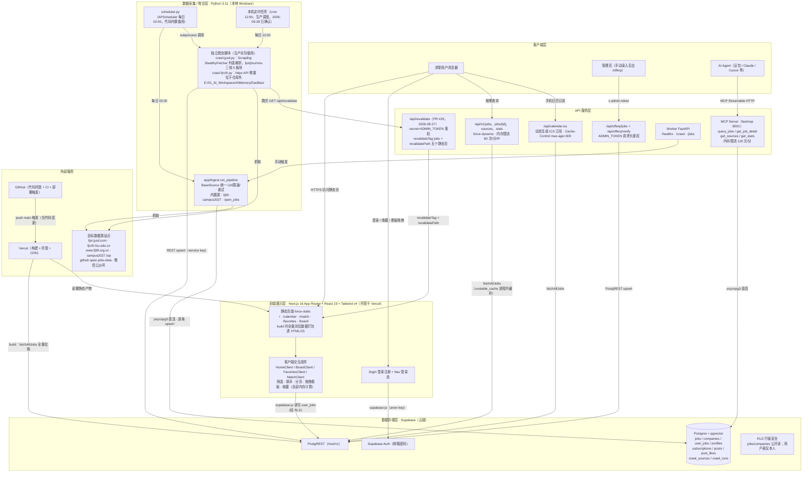

# Offer派（offer-hui）系统设计文档

> 基于代码库实际阅读整理（2026-09-27）。凡代码库中未找到依据的信息，一律标注「**待确认**」，不做臆测。  
> 阅读范围：`apps/web`（全部 lib + 核心 api 路由 + page）、`apps/worker`（app/ 包 + scheduler + cli + 独立脚本样例）、`apps/mcp`、`infra/supabase/migrations`、`.github/workflows/ci.yml`、根配置。

---

## 1. 系统概述

**定位**：应届生求职信息聚合平台（MVP，公益性质）。聚合高校就业网 / 企业官网 / 公众号 / 社区数据源，提供筛选浏览、DDL 日历订阅、求职看板、收藏、轻量 AI 匹配。**不截留简历，所有岗位跳转官方投递入口。**

**部署形态**：

| 组件           | 运行位置                                                                                 | 说明                                              |
| ------------ | ------------------------------------------------------------------------------------ | ----------------------------------------------- |
| Web（Next.js） | Vercel（<https://offerpai.vercel.app> / [www.offerpiai.cn）](http://www.offerpiai.cn）) | GitHub push main 自动部署                           |
| Worker 爬虫    | 本地 Windows                                                                           | 生产调度为豆包定时任务（cron `0 12 * * *`，2026-09-28 用户确认），依赖电脑开机      |
| MCP Server   | 本地 `:8001`                                                                           | Streamable HTTP，供 AI Agent 调用                   |
| 数据库/Auth     | Supabase 云（project `sqmgjxazzpcfjutzscyu`）                                           | Postgres 16 + pgvector + Auth + PostgREST + RLS |

---

## 2. 系统架构图（Mermaid 分层架构）



**端到端数据流图**：

```mermaid
flowchart LR
    subgraph A["① 采集"]
        A1["高校就业网 / 企业官网<br>公众号 / 社区开源数据 / 手动录入"]
    end
    subgraph B["② 清洗 · 归一化 · 去重"]
        A2["Job dataclass 字段归一化<br>content_hash = SHA1(标题+公司+城市<br>+行业+学历+薪资+DDL+投递链接+tags)"]
        A3["upsert 去重<br>UNIQUE(source, external_id)<br>不存在→INSERT(new)<br>hash 变化→UPDATE(updated)<br>相同→skip"]
        A4["mark_expired<br>本轮未出现的源内岗位<br>status→expired"]
    end
    subgraph C["③ 入库"]
        A5[("Supabase jobs / companies<br>监控写 crawl_sources / crawl_runs")]
    end
    subgraph D["④ 缓存按需失效（on-demand revalidation，PR #29）"]
        A6["GET /api/revalidate?secret=ADMIN_TOKEN<br>revalidateTag(jobs, expire=0)<br>+ revalidatePath 五个静态页"]
        A7["下次访问触发页面重新生成<br>fetchAllJobs 重新全量拉取"]
        A8["新数据约 300ms 生效<br>无需 git push / 重新 build"]
    end
    subgraph E["⑤ 检索 · 展示"]
        A9["浏览器端 filterJobs / sortJobsBy / 分页"]
        A10["岗位卡片 → 跳官方投递入口"]
    end
    A1 --> A2 --> A3 --> A5
    A3 --> A4 --> A5
    A5 --> A6 --> A7 --> A8 --> A9 --> A10
```



---

## 3. 技术栈与依赖清单

### 3.1 前端（apps/web）

| 依赖                                    | 版本                 | 用途                         |
| ------------------------------------- | ------------------ | -------------------------- |
| next                                  | 16.3.4（App Router） | 框架 + 静态生成 + Route Handlers |
| react / react-dom                     | 19.2.8             | UI                         |
| @supabase/supabase-js / @supabase/ssr | 2.116.0 / 0.12.7   | 浏览器端 Auth + user_jobs 读写   |
| tailwindcss                           | v4                 | 样式                         |
| qr-code-styling                       | 1.9.2              | QQ 群二维码渲染                  |
| typescript / eslint                   | 5.x / 9.x          | 工程化                        |

### 3.2 Worker（apps/worker，Python 3.11）

| 依赖                                           | 用途                                                     |
| -------------------------------------------- | ------------------------------------------------------ |
| fastapi + uvicorn                            | Worker HTTP 服务（/healthz /crawl /jobs）                  |
| httpx                                        | 内置源的异步 HTTP 抓取                                         |
| scrapling[fetchers] / curl_cffi / patchright | 反爬抓取（StealthyFetcher 等），用于独立脚本                         |
| psycopg[binary] 3.x                          | Postgres 直连（pgbouncer 事务模式下需 `prepare_threshold=None`） |
| apscheduler                                  | BlockingScheduler 定时调度（代码内置方案）                         |
| pydantic / python-dotenv                     | 校验 / .env 配置                                           |

### 3.3 MCP（apps/mcp）

fastmcp ≥ 2.0（Streamable HTTP）+ psycopg + python-dotenv；复用 `apps/worker/.env` 的 `DATABASE_URL`。

### 3.4 环境变量 / 配置

| 位置                  | 变量                                                                                                                                                 | 说明                              |
| ------------------- | -------------------------------------------------------------------------------------------------------------------------------------------------- | ------------------------------- |
| apps/web/.env.local | NEXT_PUBLIC_SUPABASE_URL / ANON_KEY                                                                                                                | 浏览器端（公开）                        |
| 同上                  | SUPABASE_URL / SUPABASE_SERVICE_KEY                                                                                                                | 服务端数据层，**绝不能加 NEXT_PUBLIC_ 前缀** |
| 同上                  | ADMIN_TOKEN                                                                                                                                        | /api/offerp/* 鉴权                |
| apps/worker/.env    | DATABASE_URL / SUPABASE_URL / SUPABASE_SERVICE_KEY / USER_AGENT / REQUEST_DELAY / MAX_ITEMS_PER_SOURCE / STORAGE_BACKEND（默认 sqlite，实际固定走 postgres） | 爬虫入库                            |
| Vercel              | 上述 4 个 Supabase 变量必须配齐，否则 build 失败                                                                                                                 | CI 用 placeholder 降级             |

### 3.5 系统边界与外部依赖总表

| 类别    | 现状                                                                                                                                                |
| ----- | ------------------------------------------------------------------------------------------------------------------------------------------------- |
| 数据源接入 | 高校就业网（fjut/fjrclh/fj99）、国家 24365（ncss，内置源但当前 pipeline 未挂载，见 §6）、企业官网（蔚来/小米/小鹏，经 feishu 源）、社区（campus2027 / open_jobs）、公众号（wechat，历史导入）、manual 手动录入 |
| 存储    | Supabase Postgres（唯一持久层）；localStorage 作为未登录态的离线缓冲                                                                                                 |
| 检索    | **无服务端检索**：静态页数据全量下发，筛选/关键词匹配（`includes`）全在浏览器内存完成；MCP/API 路由侧为 SQL ILIKE + 分页                                                                    |
| 缓存    | ① Next.js `unstable_cache`（revalidate:false，进程内，build 时拉一次）；② ICS 响应 `Cache-Control: max-age=300`；③ 静态生成本身。**无 Redis 等外置缓存（代码库未发现）**              |
| 消息队列  | **无（代码库未发现）**。模块间通过「数据库 + /api/revalidate 按需失效」松耦合（PR #29，git push 仅在代码变更时触发 build）                                                                                                       |
| 登录    | 仅 Supabase Auth 邮箱密码。第三方 OAuth 登录未实现（见 §11 #7，规划中）                                                                                              |
| 监控    | crawl_sources / crawl_runs 表记录每次爬取；主动告警通知未实现（见 §11 #8，规划中）                                                                                             |

---

## 4. 核心模块职责与关键实现位置

| 模块            | 职责                                                                                                                         | 关键实现位置                                                                                                                    |
| ------------- | -------------------------------------------------------------------------------------------------------------------------- | ------------------------------------------------------------------------------------------------------------------------- |
| 数据模型          | Job/公司字段归一化 + content_hash 计算（SHA1，排序键序列化）                                                                                 | `apps/worker/app/models.py`                                                                                               |
| 数据源基类         | 统一 UA/Referer、源间限速（REQUEST_DELAY 递增）、连接类错误指数退避重试（3 次，4xx/5xx 不重试）                                                          | `apps/worker/app/sources/base.py`                                                                                         |
| 内置源实现         | fj99（POST+md5 签名）、campus2027、open_jobs 等                                                                                   | `apps/worker/app/sources/*.py`（另有 hit/pku/ncss/feishu 文件，当前 `get_sources()` 仅挂载 fj99/campus2027/open_jobs，其余 hit/pku 已停用、ncss 未挂载、feishu_* 为历史导入——见 §11 结论） |
| 存储层           | psycopg 直连 Supabase；upsert 三态（new/updated/skipped）；mark_expired 过期标记；record_run 监控落表；company 按 name upsert                 | `apps/worker/app/storage.py`                                                                                              |
| 管道编排          | 串行遍历源 → 抓取 → upsert → 过期标记 → 监控 → 统计                                                                                       | `apps/worker/app/ingest.py`                                                                                               |
| 调度器           | APScheduler 每日 02:00（Asia/Shanghai，misfire_grace_time 3600s）跑 pipeline + subprocess 调两个仓库外脚本                               | `apps/worker/scheduler.py`                                                                                                |
| Worker API    | 手动触发/健康检查/查询                                                                                                               | `apps/worker/app/main.py`、`apps/worker/cli.py`                                                                            |
| 独立爬虫（生产主力）    | fjut/jmu/xmu 三校 5 板块（jysd 平台，Scrapling 列表解析）、fjrclh（httpx API 增量）；**权威版本在仓库 `scripts/crawl/`，本机执行副本在仓库外 `E:\01_AI_Workspace\AIMemory\DaoBao\`** | `scripts/crawl/crawl-jysd.py`、`scripts/crawl/crawl-fjrclh.py`（2026-10-10 起 `crawl-fjut.py` 已退役） |
| Web 数据层       | PostgREST 分页全量拉取（每页 1000 循环）→ JobView 映射（来源中文名/徽标渐变/DDL 天数计算，北京时区）；filterJobs/sortJobsBy/dimOptions                        | `apps/web/lib/jobs.ts`                                                                                                    |
| 浏览器端 Supabase | anon key 客户端，persistSession + autoRefreshToken                                                                             | `apps/web/lib/supabase.ts`                                                                                                |
| 用户数据双写        | localStorage 先写 → 登录则 upsert user_jobs → 登录时补传本地增量 → onAuthStateChange 全量覆盖本地                                              | `apps/web/components/HomeClient.tsx` / `BoardClient.tsx` / `FavoritesClient.tsx`（逻辑约定见 AGENTS.md §4.3）                    |
| 限流            | Web：内存 Map 按 IP 60 次/分；MCP：内存滑动窗口 120 次/60s（均为**单实例内存级**，多实例不共享）                                                           | `apps/web/lib/ratelimit.ts`、`apps/mcp/server.py` `_check_rate()`                                                          |
| 手动录入后台        | ADMIN_TOKEN 鉴权；公司 upsert → tags 拼装 → jobs upsert（external_id=`manual:公司:岗位`）；GET/POST/DELETE                               | `apps/web/app/api/offerp/jobs/route.ts`                                                                                   |
| ICS 日历        | 动态生成未来 90 天有 DDL 岗位的 VEVENT；force-dynamic + max-age=300                                                                    | `apps/web/app/api/calendar.ics/route.ts`                                                                                  |
| MCP 接入层       | 4 个工具（query_jobs/get_job_detail/get_sources/get_stats），SQL 侧筛选排序（学历层级 CASE 表达式与前端 degreeLevel 对齐）                          | `apps/mcp/server.py`                                                                                                      |
| AI 匹配（轻量）     | **纯前端规则引擎**：硬编码画像（2027 届/本科/行业/城市/关键词）+ 加权打分（届别 35 + 行业 25 + 学历 20 + 城市 15 + 关键词 ≤20，封顶 100）；简历解析为模拟。pgvector + LLM 为规划未实现 | `apps/web/components/MatchClient.tsx`                                                                                     |
| 数据库 Schema    | 两份迁移：init（全表+RLS）+ user_jobs（线上实际用户表）；`applications`/`saved_jobs` 已废弃但保留                                                   | `infra/supabase/migrations/`                                                                                              |
| CI            | web：npm install + lint（不阻塞）+ build（placeholder 环境变量）；worker：pgvector/pg16 服务容器 + auth stub + init.sql + unittest           | `.github/workflows/ci.yml`                                                                                                |

---

## 5. 完整数据流（采集 → 清洗去重 → 归一化入库 → 检索展示）

### 5.1 采集

两条并行链路：

1. **生产链路（本机定时任务，每日 12:00）**：依次执行仓库外 `crawl-jysd.py`（Scrapling StealthyFetcher 列表解析，fjut/jmu/xmu 三校，抓全职/实习/宣讲会/招聘会/招聘公告 5 板块）与 `crawl-fjrclh.py`（httpx 调 API 增量），通过 Supabase REST（service key）upsert 入库。（2026-10-10：原 `crawl-fjut.py` 因与 crawl-jysd.py 抢写 source=fjut 已退役删除。）
2. **内置链路（scheduler.py 每日 02:00，或手动 `cli.py crawl` / `POST /crawl`）**：`run_pipeline()` 串行遍历 `get_sources()` 挂载的内置源，psycopg 直连入库。

### 5.2 清洗 · 归一化 · 去重

- **归一化**：各源把原始条目映射为统一 `Job` dataclass（source/source_url/external_id/title/company_name/city/industry/job_type/degree/cohort/salary_min/max/text/deadline_at/posted_at/apply_url/tags）。job_type 枚举：campus/intern/fair/teachin/announcement（init.sql 注释只写了前三种，teachin/announcement 由 fjut 爬虫引入）。
- **content_hash**：对 title/company/city/industry/degree/salary/salary_text/deadline/apply_url/tags 做 sort_keys JSON → SHA1。字段任一变化即触发 UPDATE。
- **去重键**：`UNIQUE(source, external_id)`；jobs.id 由 `uuid5(NAMESPACE_URL, "{source}:{external_id}")` 确定性生成（内置链路），手动录入链路用 randomUUID + `on_conflict=source,external_id`。
- **状态流转**：新条目 INSERT(status=published)；已存在且 hash 变化 UPDATE；本轮源列表中消失的 → `mark_expired` 置 expired（前端公开读 RLS 只放行 published，即自动下架）。
- **公司归并**：companies 按 name 唯一，存在即复用，否则 upsert（`ON CONFLICT (name) DO UPDATE SET industry`）。
- **监控**：每次运行写 crawl_sources（last_run_at/last_success_at）+ crawl_runs（found/new/updated/error）。


### 5.3 数据生效链路（on-demand revalidation，2026-09-27 PR #29/#30 改造）

爬虫入库完成 → `GET /api/revalidate?secret=<ADMIN_TOKEN>`（实现见 `apps/web/app/api/revalidate/route.ts`）→ 接口内部执行 `revalidateTag("jobs", { expire: 0 })` 失效 `fetchAllJobs` 的 unstable_cache + `revalidatePath` 失效 `/`、`/calendar`、`/match`、`/favorites`、`/board` 五个静态页 → 下次访问时页面按需重新生成，`fetchAllJobs()` 重新从 PostgREST 分页（每页 1000）拉取**全量**岗位 → 约 300ms 生效。

> **历史方案（已废弃）**：早期数据刷新靠「爬虫入库后推送空改动 → 触发平台全量重建」。PR #29（2026-09-27 20:48 合并）改为按需失效后，git push 仅在**代码变更**时触发构建。改版动机：修复「爬虫已入库但网站不更新」（unstable_cache 跨部署持久，不主动失效就一直返回旧数据）。

### 5.4 检索展示

- 用户访问静态页 → 数据已在 bundle 里 → **筛选（城市/行业/届别/学历层级/jobType/关键词）、排序（deadline/newest/salary）、分页全部在浏览器内存完成**（`filterJobs`/`sortJobsBy`）。学历筛选用层级模型（不限 0/专科 1/本科 2/硕士 3/博士 4），支持「本科及以上」这类向下兼容查询。
- 用户登录后：收藏（star）与看板（pending/applied/written/interview/offer）双写 localStorage + `user_jobs`（RLS 限本人）；换设备登录时本地增量补传，再以库内全量覆盖本地。
- `/api/calendar.ics` 供手机日历订阅，动态生成 90 天内 DDL 事件。
- 外部程序：REST `/api/v1/jobs`（内存限流）与 MCP 4 工具（psycopg 直连 SQL 筛选）。
- 岗位卡片 `apply_url` 直接跳官方投递入口，平台不截留。

---

## 6. 核心数据实体与关键字段

### jobs（核心表）

| 字段                                   | 类型                   | 说明                                                                                                      |
| ------------------------------------ | -------------------- | ------------------------------------------------------------------------------------------------------- |
| id                                   | uuid PK              | 内置链路为 uuid5(source:external_id)                                                                         |
| source / external_id                 | text                 | **联合唯一**，去重键；source 枚举见 SOURCE_NAME（ncss/fjut/fjrclh/fj99/feishu\_*/campus2027/open_jobs/wechat/manual） |
| source_url                           | text NOT NULL UNIQUE | 原始页面（权威来源）                                                                                              |
| title / description                  | text                 | description 仅手动录入与详情用                                                                                   |
| city / province / industry / cohort  | text                 | 展示筛选维度                                                                                                  |
| job_type                             | text                 | campus/intern/fair/teachin/announcement                                                                 |
| degree                               | text                 | 自由文本，展示层解析为 0-4 层级                                                                                      |
| salary_min/max numeric + salary_text | —                    | text 优先展示                                                                                               |
| deadline_at / posted_at              | timestamptz          | DDL 驱动排序与 ICS                                                                                           |
| apply_url                            | text NOT NULL        | 官方投递入口（不截留）                                                                                             |
| status                               | text                 | published/expired/archived，RLS 公开读仅 published                                                           |
| tags                                 | jsonb GIN 索引         | 手动录入时拼「来源：xxx」等                                                                                         |
| content_hash                         | text                 | 变更检测                                                                                                    |
| embedding                            | vector(1536)         | **已建列，未发现生成管线**（AI 匹配走前端规则引擎）；HNSW 索引在迁移注释中标注「数据量大后启用」                                                  |

### 其他实体

| 表                          | 关键字段                                                                                      | 说明                                                             |
| -------------------------- | ----------------------------------------------------------------------------------------- | -------------------------------------------------------------- |
| companies                  | name UNIQUE, industry, logo_url, verified                                                 | 按 name 归并                                                      |
| user_jobs                  | (user_id, job_id, status) UNIQUE；status∈star/pending/applied/written/interview/offer；note | **收藏+看板合一**，线上实际用户表；RLS `auth.uid()=user_id`                   |
| profiles                   | username/university/major/cohort                                                          | 关联 auth.users                                                  |
| subscriptions              | filters jsonb, ics_token, push_sub                                                        | 个性化订阅；**calendar.ics 当前为全量公共接口，未使用 ics_token 过滤——个性化订阅未实现（见 §11 #4，已确认）** |
| posts / post_likes         | status pending/approved（先审后发）                                                             | 社区；审核管理入口未实现（见 §11 #5，已确认）                                               |
| crawl_sources / crawl_runs | last_run_at, items_found/new/updated, error                                               | 爬虫监控                                                           |
| saved_jobs / applications  | —                                                                                         | init.sql 遗留，**已废弃**（user_jobs 取代），空表保留                         |

---

## 7. 接口清单

### Web Route Handlers（Next.js）

| 接口                                              | 方法              | 模式            | 鉴权/限流                                                                   |
| ----------------------------------------------- | --------------- | ------------- | ----------------------------------------------------------------------- |
| /api/v1/jobs                                    | GET             | force-dynamic | IP 内存限流 60/分；q/job_type/city/industry/cohort/degree/sort/page/page_size |
| /api/v1/jobs/[id]、/api/v1/sources、/api/v1/stats | GET             | force-dynamic | 同上                                                                      |
| /api/calendar.ics                               | GET             | force-dynamic | 公开；Cache-Control 300s                                                   |
| /api/offerp/jobs                                | GET/POST/DELETE | —             | x-admin-token                                                           |
| /api/offerp/verify                              | POST            | —             | x-admin-token                                                           |
| /api/revalidate                                 | GET             | force-dynamic | secret 参数须等于 ADMIN_TOKEN；revalidateTag("jobs", expire=0) + revalidatePath 五个静态页 |
| /agents/skill.md                                | GET             | —             | Agent 接入说明文档                                                            |

### Worker HTTP / MCP

| 接口                                                        | 说明                               |
| --------------------------------------------------------- | -------------------------------- |
| FastAPI /healthz、/crawl（dry_run 可选）、/jobs                 | 手动触发与查询                          |
| MCP query_jobs / get_job_detail / get_sources / get_stats | Streamable HTTP :8001，全局 120 次/分 |

---

## 8. 模块依赖顺序

```
apps/worker（自底向上）：
  config.py ← models.py ← sources/base.py ← sources/{fj99,campus2027,open_jobs,...}
  storage.py ← ingest.py ← {main.py(FastAPI), cli.py, scheduler.py}
  独立脚本 crawl_jysd/crawl_fjrclh 不依赖 app/ 包，直连 Supabase REST

apps/web：
  lib/jobs.ts ← {app/page.tsx, calendar/match/favorites/board page, api/v1/*, api/calendar.ics}
  lib/supabase.ts ← 客户端组件（LoginClient/HomeClient/BoardClient/FavoritesClient）
  lib/ratelimit.ts ← api/v1/*
  api/offerp/* 独立（直接 PostgREST + ADMIN_TOKEN）

apps/mcp/server.py：仅依赖 worker/.env 的 DATABASE_URL，与 worker 代码零耦合
```

构建/部署顺序：`push main` → CI（web build + worker unittest）→ EdgeOne/Vercel build（fetchAllJobs）→ 静态产物上线。数据更新：爬虫入库后调 `GET /api/revalidate?secret=<ADMIN_TOKEN>` 按需失效（PR #29），约 300ms 生效，**不依赖重新 build**；git push 仅在代码变更时触发构建。

---

## 9. 并发与定时任务处理策略

| 方面   | 现状                                                                                                                                                   |
| ---- | ---------------------------------------------------------------------------------------------------------------------------------------------------- |
| 抓取并发 | **源间串行**（for 循环逐源 await，共用一个 httpx.AsyncClient）；源内逐条处理。无 asyncio.gather 并发                                                                           |
| 限速   | 全局 REQUEST_DELAY（默认 1.2s）× 尝试次数递增等待；BaseSource 重试 3 次、指数退避（4s×2^n），仅连接/超时类错误重试                                                                       |
| 写入   | 逐条 upsert（每条 1-2 次 SQL 往返），非批量；mark_expired 为 N+1 逐条 UPDATE                                                                                          |
| 定时调度 | 单一生产调度：豆包定时任务跑两个仓库外脚本（cron `0 12 * * *`，2026-09-28 用户确认）；scheduler.py APScheduler（02:00）为代码内置备用方案，当前未跑 |
| 失败容忍 | misfire_grace_time 3600s；单源异常捕获不影响其他源；结果记入 crawl_runs                                                                                                |
| 前端并发 | 静态页 + 内存计算，无服务端并发压力；用户态操作为浏览器直连 Supabase（RLS 兜底）                                                                                                     |
| 缓存失效 | 爬虫跑完调 `/api/revalidate`（PR #29）按需失效，约 300ms 生效，无整站重建；git push 仅在代码变更时触发 build |                                                                                                |

---

## 10. 瓶颈与可扩展点

### 瓶颈（按影响排序）

1. **~~数据更新 = 全量重新 build~~ 已解决**（PR #29，2026-09-27 20:48 合并）：爬虫入库后调 `GET /api/revalidate?secret=<ADMIN_TOKEN>`，内部 `revalidateTag("jobs", {expire:0})` + `revalidatePath` 五个静态页，约 300ms 生效，不再整站重建；AGENTS.md 与豆包任务流程已同步改造（PR #30）。
2. **全量数据下发**：`fetchAllJobs` 把所有岗位打包进**每个**静态页的 JS bundle，5 个静态页各带一份；数据到几千条时首屏体积与客户端内存/筛选耗时线性增长。
3. **`unstable_cache` 为单实例进程内缓存**（已缓解，未根治）：`revalidateTag` 已能主动失效，但 Vercel serverless 多实例/冷启动仍不共享，失效后首个请求会全量重拉一次；ICS 有 `Cache-Control: max-age=300` 兜底，影响可控。
4. **限流均为单实例内存态**：多实例下限流失效，且重启即清零（MVP 可接受，公开写操作仅 ADMIN_TOKEN 后台）。
5. **爬虫串行 + 逐条 upsert** → **部分解决（2026-09-27 生产链路改造）**：① 逐条 upsert 已改 PostgREST 批量 upsert（`POST /jobs?on_conflict=source,external_id` + `Prefer: merge-duplicates`，500 条/批，5xx/429 退避重试）；② 增量模型改 content_hash 三分类（eid 不在映射=新增 / hash 不等=变更 / 相等=跳过），跳过项零写库，过期标记改单条批量 `PATCH ?external_id=in.(...)`；③ 失败行不中断整批，次日 hash 比对自愈。**剩余**：详情页抓取仍串行（REQUEST_DELAY 是反爬要求，不能并发）；pgbouncer prepared statement 限制已用 `prepare_threshold=None` 规避（不变）。
6. **调度依赖本地 Windows 开机 + 豆包在线**：单点，无失败告警（仅 crawl_runs 表记录，无主动通知）。
7. **embedding/pgvector 已建未用**：无向量生成管线，AI 匹配为前端硬编码规则（画像写死 2027 届/本科）。

### 可扩展点（与瓶颈一一对应）

1. ~~改 ISR / revalidateTag~~ **已落地**（PR #29，`/api/revalidate`）：数据更新走按需失效，不再依赖推送触发平台重建。
2. 数据量超阈值后把筛选/分页下沉服务端：PostgREST 过滤参数、Postgres 全文检索，或直接启用 pgvector 语义检索 + HNSW 索引。
3. 抓取改 `asyncio.gather` 按源并发（批量写入与 mark_expired 批量化已于 2026-09-27 随生产链路改造落地——走 PostgREST upsert 而非 psycopg COPY）。
4. 调度外移：GitHub Actions cron / 云函数定时器跑爬虫（需解决出口 IP 与反爬），或至少加跑失败告警（如读 crawl_runs 推送）。
5. 接入 embedding 生成管线（爬虫侧调用 embedding API 写入 `jobs.embedding`），使 /match 从规则引擎升级为语义匹配 + LLM 理由（代码注释中已有此规划）。
6. user_jobs 双写链路可增加乐观锁/失败重试提示；localStorage 与库内冲突合并策略目前是「登录后全量覆盖」，换设备场景可能覆盖未同步的本地记录（**待确认产品预期**）。

---

## 11. 待确认清单（2026-09-27 已由另一协作 Agent 结合数据库/运行时记录逐条核实）

| # | 事项 | 结论（来源：协作 Agent 核实 + 代码比对） |
|---|---|---|
| 1 | sources/hit.py、pku.py、ncss.py、feishu.py 是否仍启用 | hit/pku 已停用（无数据痕迹）；ncss 内置源当前未挂载（库内 47 条为历史导入）；feishu_* 库内有数据（nio 242 / mi 221 / xiaopeng 271）均为历史导入。生产实际只跑仓库外 fjut + fjrclh 两个脚本 |
| 2 | scheduler.py（02:00）与豆包定时任务是否双轨 | 否，单一生产调度（豆包任务）；scheduler.py 为代码内置备用方案，当前未跑。✅ 豆包 cron 已确认为 `0 12 * * *`（2026-09-28 用户确认，AGENTS.md 此前声明的 `0 2 * * *` 有误已修正） |
| 3 | 仓库内外同名脚本是否同步 | 生产跑仓库外 `E:\AIMemory\DaoBao\` 两脚本；仓库内副本同步状态未核对，可能是旧版 |
| 4 | subscriptions.ics_token 个性化日历 | 未实现，字段空置；calendar.ics 为全量公共接口 |
| 5 | 社区 posts 审核入口 | 未实现；仅 RLS 先审后发，无管理界面 |
| 6 | resumes 表 | 未启用（迁移存在，AGENTS.md 标注未启用） |
| 7 | 第三方 OAuth 登录 | 未实现；仅 Supabase Auth 邮箱密码。Supabase 原生支持 OAuth，接入成本低，未做 |
| 8 | 告警/通知渠道 | 未实现；仅 crawl_runs.error 落库，无主动推送。与瓶颈⑥同源，建议优先补 |
| 9 | Vercel CDN/缓存策略 | 仓库无 vercel.json；现状 = 静态页 + /api/revalidate 按需失效 + ICS 300s，其余走 Vercel 默认 |
